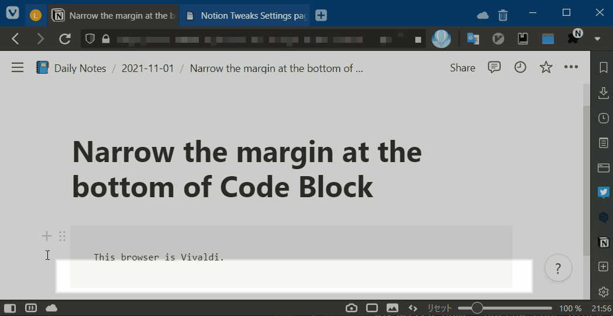

# Notion Tweaks
Chrome Extension to tweak Notion.

## Features

+ Open or Create Today's Page of a specific database
+ Create Page of a specific database quickly
+ Enter the timestamp(HH:mm) quickly
+ Close Slash command menu and Emoji menu
+ Narrow the margin at the bottom of Code Block
+ Always show the language of Code Block

## Today's Page
If you specify the id of the Notion database and type `Ctrl + shit + y`,
Today's Page of that database will be opened.  
If the page has not been created, it will opened after it is created.  

Here are the details of the page that was created.

|               |              |
|---------------|--------------|
| Title         | `YYYY-MM-DD` |
| Date property | `YYYY-MM-DD` |
| Page Contents | None         |

**require**

+ [`Share` a database with yout integration](https://developers.notion.com/docs)
+ `Select API` and `GAS URL or Notion API key`
+ Daily Database id
+ Turn on `Today's Page` the Settings page

## Create Page of a specific database quickly
If you specify the id of the Notion database and type `Ctrl + q` + `z` in Notion page,
Untitled Page of that database will be created and insert the url.  
If you were selecting a string, that string will become the title.  

This is useful when Notion is treated as a Zettelkasten.  

I forget the spelling `Zettelkasten`, so I write z10n.  

**require**

+ [`Share` a database with yout integration](https://developers.notion.com/docs)
+ `Select API` and `GAS URL or Notion API key`
+ z10n Database id
+ Turn on `Create Page of z10n database` the Settings page
+ If you have already opened a Notion page, reload it

## Enter the timestamp(HH:mm) quickly
If you type `Ctrl + q` + `t` in Notion page,
timestamp will be inserted. Its format is `HH:mm`.  

**require**
+ Turn on `Time Stamp` the Settings page
+ If you have already opened a Notion page, reload it

## Close Slash command menu and Emoji menu
If you type `Ctrl + q` + `c` while Slach command or Emoji menu is displaying,
the menu will be closed.  

**require**
+ Turn on `Close menu` the Settings page
+ If you have already opened a Notion page, reload it

## Narrow the margin at the bottom of Code Block
This feature makes the margin at the bottom of Code Block narrower.  

**require**
+ Turn on `Narrower Code Block Bottom` the Settings page
+ If you have already opened a Notion page, reload it

## Always show the language of Code Block
This feature makes the language of Code Block always visible.  

**require**
+ Turn on `Show Code Block Language` the Settings page
+ If you have already opened a Notion page, reload it

